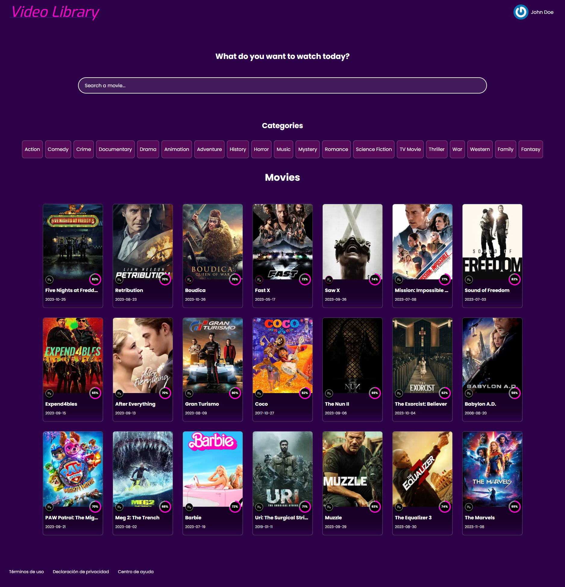
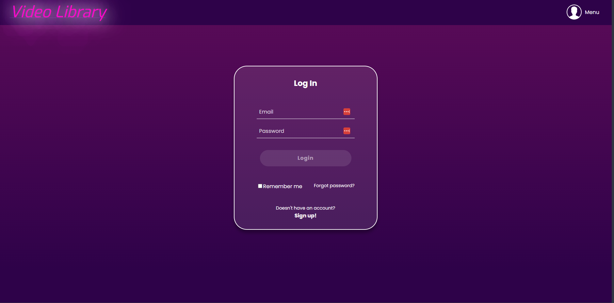
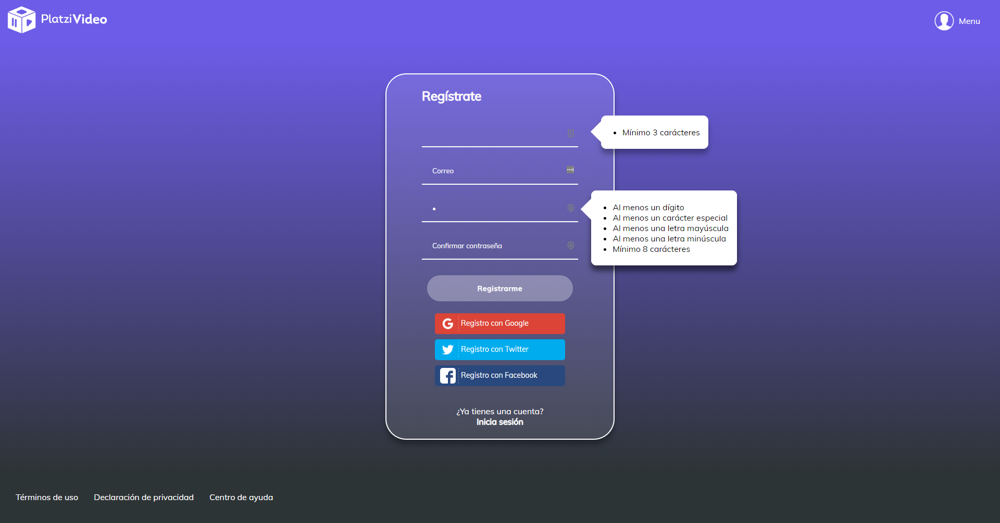

# Una App de Videos creada con React.JS

¡Bienvenido y gracias por visitarme! Este es un proyecto de aprendizaje elaborado en la escuela de JavaScript de [Platzi](https://platzi.com/escuela-javascript/) en donde aplico varios de los conocimientos y habilidades adquiridas, entre ellas:

- Conocer el lenguaje Javascript, desarrollando rutinas y programas básicos usando el lenguaje
- Desarrollar sitios web estáticos usando HTML y CSS
- Agregar capacidades de interactividad con Javascript usando React, React Router y Redux
- Trabajar con Javascript en el backend usando Node.js, Express y MongoDB
- Implementar SSR en tus proyectos para mejorar la percepción de velocidad de tu sitio
- Realizar la integración del Backend y el Frontend de la aplicación
- Agregar capacidades de autenticación usando Passport.js
- Implementar pruebas tanto en el Backend como en el Frontend con Jest

## Vista de Home

## Vista del Login

## Vista de Registro

[Ver la aplicación](https://platzi-videos.herokuapp.com)

## ¿Cómo funciona?

Si desea, clonar el proyecto es necesario contar con Node.JS 12.6.x y seguir las siguientes instrucciones.

- `npm install` para instalar las dependencias.
- `npm run dev` para el entorno de desarrollo.
- `npm run build && npm start` para el entorno de producción.

Tener en cuenta que se debe configurar el archivo `.env` con las variables de entorno propias en caso de ser usadas.

## Licencia

[MIT License](LICENSE)
